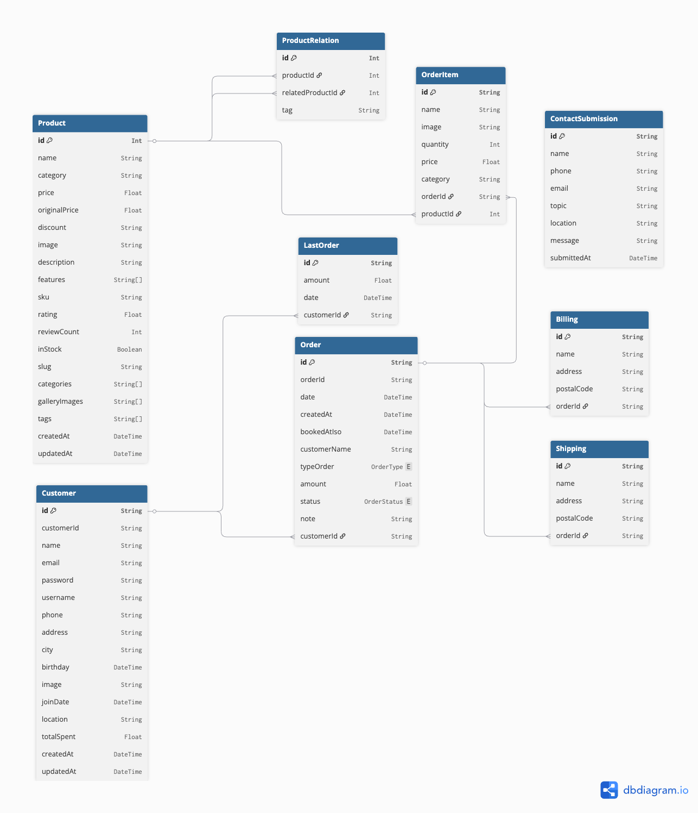

# Restaurant Management Backend API

## Overview

This is a comprehensive NestJS backend application for restaurant management, featuring a complete e-commerce system with customer management, product catalog, order processing, and more. The application uses Prisma ORM with PostgreSQL and implements JWT authentication with role-based access control.

## Features

- **Authentication & Authorization**
  - JWT-based authentication
  - Role-based access control (USER and ADMIN roles)
  - Password hashing with bcrypt
  - Protected routes with guards and decorators

- **Access Control**
  - Role-based permissions
  - Resource ownership validation
  - Public routes for selected endpoints
  - Admin access to all resources

- **Customer Management**
  - User registration and authentication
  - Profile management
  - Role assignment

- **Product Management**
  - Product catalog with public access
  - Product relations for related items
  - Admin-only product creation and modification

- **Order Processing**
  - Order creation and management
  - Order items tracking
  - Billing and shipping information
  - Last orders history

- **Contact Submissions**
  - Public form submissions
  - Admin review capabilities

## Tech Stack

- **Framework**: NestJS 11
- **Database**: PostgreSQL with Prisma ORM
- **Authentication**: Passport.js with JWT
- **Validation**: class-validator and class-transformer
- **API Documentation**: Swagger/OpenAPI


## Project Structure

- `src/auth/` - Authentication module
- `src/common/` - Common utilities and middleware
- `src/customers/` - Customer management
- `src/products/` - Product catalog
- `src/orders/` - Order processing
- `src/order-items/` - Order items management
- `src/billings/` - Billing information
- `src/shippings/` - Shipping details
- `src/last-orders/` - Order history
- `src/contact-submissions/` - Contact form submissions
- `src/product-relations/` - Related products

## Access Control Rules

- **Public Routes**: Login, register, product catalog, contact submissions
- **Customer-specific**: Users can only access their own data
- **Products**: Public read access, admin-only write access
- **Admin**: Full access to all resources

## User Interface
*ERD Documentation*


## License

This project is licensed under the [UNLICENSED](LICENSE) license.

## Getting Started

### Prerequisites

- Node.js (v18 or higher)
- PostgreSQL database
- npm or yarn

### Installation

1. Clone the repository
```bash
git clone <repository-url>
cd final-project-be-agusadico
```

2. Install dependencies
```bash
npm install
```

3. Set up environment variables
```bash
cp .env.example .env
# Edit .env with your database credentials and JWT secret
```

4. Run database migrations
```bash
npx prisma migrate dev
```

5. Seed the database (optional)
```bash
npm run prisma:seed
```

6. Start the development server
```bash
npm run start:dev
```

### API Documentation
Endpoint Documentation:
Public Routes:
- `/auth/login` (POST): User login
- `/auth/register` (POST): User registration
- `/products` (GET): Retrieve all products
- `/contact-submissions` (POST): Submit contact form

Once the server is running, you can access the Swagger documentation for detailed endpoint documentation at: http://localhost:4005/api/